Design patterns are standard solutions to common software design problems. They provide a template for how to solve a problem in various contexts and can enhance code readability and reusability. Here’s a detailed overview of the main categories of design patterns in Java:
### **1. Creational Patterns**
Creational patterns deal with object creation mechanisms, trying to create objects in a manner suitable to the situation.
- **Singleton Pattern**
  - Ensures that a class has only one instance and provides a global point of access to it.
  - Useful in scenarios where a single object is needed to coordinate actions across the system.
  - Implementation involves a private constructor and a static method for obtaining the instance.
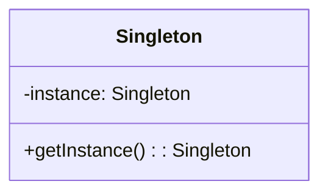

```java
class Singleton {
    private static Singleton instance;

    private Singleton() {}

    public static Singleton getInstance() {
        if (instance == null) {
            instance = new Singleton();
        }
        return instance;
    }
}
```

- **Factory Method Pattern**
  - Defines an interface for creating an object but lets subclasses alter the type of created objects.
  - Promotes loose coupling by eliminating the need for the client to know about concrete classes.
  - [[08 - Creational Design Patterns - Prototype, Factory Method and Abstract Factory]]

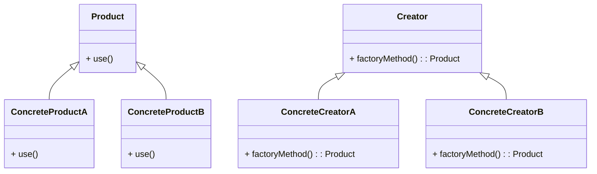

```java
// Abstract Product
abstract class Product {
    abstract void use();
}

// Concrete Products
class ConcreteProductA extends Product {
    void use() {
        System.out.println("Using Product A");
    }
}

class ConcreteProductB extends Product {
    void use() {
        System.out.println("Using Product B");
    }
}

// Abstract Creator
abstract class Creator {
    abstract Product factoryMethod(); // Factory method

    // Other methods can be defined here
    public void someOperation() {
        // Call the factory method to create a product
        Product product = factoryMethod();
        product.use(); // Use the product
    }
}

// Concrete Creators
class ConcreteCreatorA extends Creator {
    Product factoryMethod() {
        return new ConcreteProductA(); // Create and return ConcreteProductA
    }
}

class ConcreteCreatorB extends Creator {
    Product factoryMethod() {
        return new ConcreteProductB(); // Create and return ConcreteProductB
    }
}

// Client code
public class FactoryMethodExample {
    public static void main(String[] args) {
        Creator creatorA = new ConcreteCreatorA();
        creatorA.someOperation(); // Outputs: Using Product A

        Creator creatorB = new ConcreteCreatorB();
        creatorB.someOperation(); // Outputs: Using Product B
    }
}
```

- **Abstract Factory Pattern**
  - Provides an interface for creating families of related or dependent objects without specifying their concrete classes.
  - Useful when the system needs to be independent of how its objects are created.
  - [[08 - Creational Design Patterns - Prototype, Factory Method and Abstract Factory]]
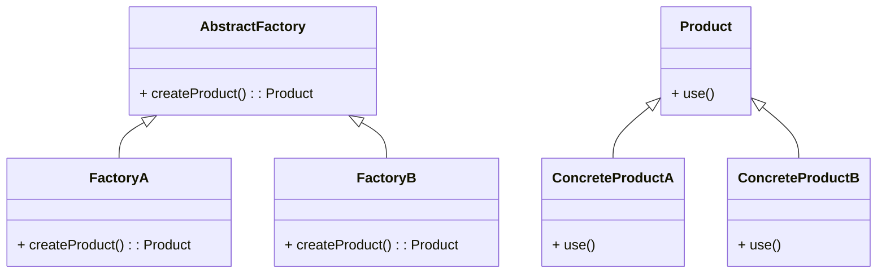

```java
interface AbstractFactory {
    Product createProduct();
}

class FactoryA implements AbstractFactory {
    public Product createProduct() {
        return new ConcreteProductA();
    }
}

class FactoryB implements AbstractFactory {
    public Product createProduct() {
        return new ConcreteProductB();
    }
}
```

- **Builder Pattern**
  - Separates the construction of a complex object from its representation, allowing the same construction process to create different representations.
  - Particularly useful for constructing objects with many optional parameters.
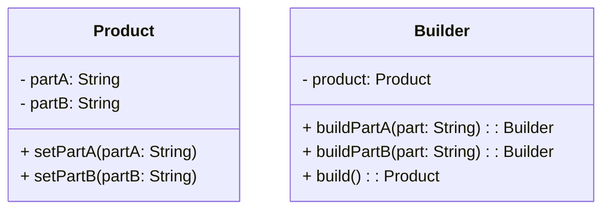
```java
class Product {
    private String partA;
    private String partB;

    public void setPartA(String partA) { this.partA = partA; }
    public void setPartB(String partB) { this.partB = partB; }
}

class Builder {
    private Product product = new Product();

    public Builder buildPartA(String part) {
        product.setPartA(part);
        return this;
    }

    public Builder buildPartB(String part) {
        product.setPartB(part);
        return this;
    }

    public Product build() {
        return product;
    }
}
```

- **Prototype Pattern**
  - Creates new objects by copying an existing object, known as the prototype.
  - Useful when object creation is costly or complex.
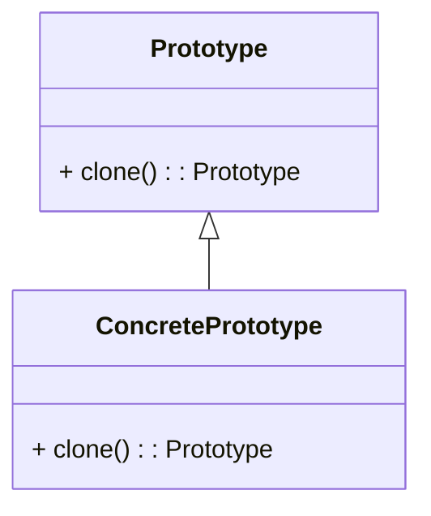
```java
abstract class Prototype implements Cloneable {
    abstract Prototype clone();
}

class ConcretePrototype extends Prototype {
    @Override
    Prototype clone() {
        return new ConcretePrototype();
    }
}
```
### **2. Structural Patterns**
Structural patterns deal with object composition and typically help ensure that if one part of a system changes, the entire system doesn’t need to change.

- **Adapter Pattern**
  - Allows incompatible interfaces to work together by converting the interface of a class into another interface that clients expect.
  - Useful when you want to use an existing class but its interface does not match what you need.
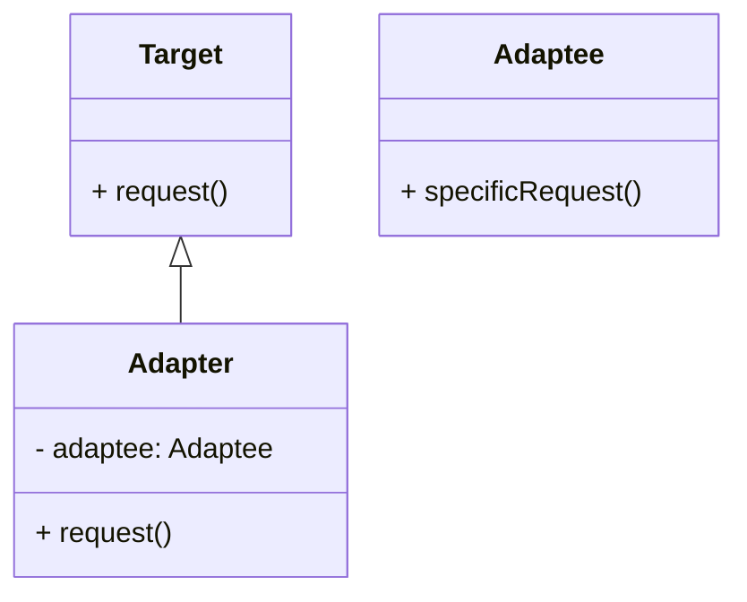
```java
interface Target {
    void request();
}

class Adaptee {
    void specificRequest() {
        System.out.println("Specific request");
    }
}

class Adapter implements Target {
    private Adaptee adaptee;

    Adapter(Adaptee adaptee) {
        this.adaptee = adaptee;
    }

    public void request() {
        adaptee.specificRequest();
    }
}
```

- **Decorator Pattern**
  - Adds new functionality to an existing object without altering its structure.
  - Useful for adhering to the Single Responsibility Principle by allowing functionality to be divided into classes with unique concerns.
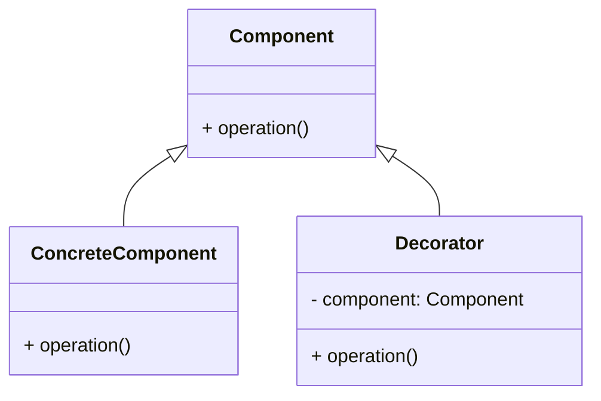
```java
interface Component {
    void operation();
}

class ConcreteComponent implements Component {
    public void operation() {
        System.out.println("Operation of Concrete Component");
    }
}

class Decorator implements Component {
    protected Component component;

    Decorator(Component component) {
        this.component = component;
    }

    public void operation() {
        component.operation();
        System.out.println("Operation of Decorator");
    }
}
```

- **Facade Pattern**
  - Provides a simplified interface to a complex subsystem.
  - Helps reduce dependencies on external code and simplifies interactions with complex systems.
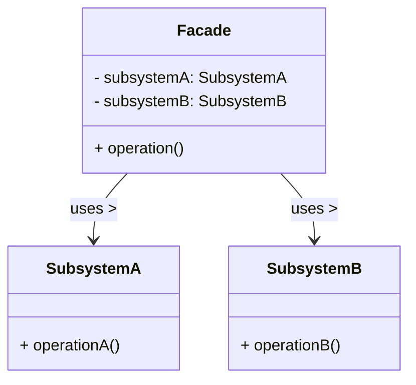
```java
class SubsystemA {
    void operationA() { System.out.println("Subsystem A operation"); }
}

class SubsystemB {
    void operationB() { System.out.println("Subsystem B operation"); }
}

class Facade {
    private SubsystemA subsystemA = new SubsystemA();
    private SubsystemB subsystemB = new SubsystemB();

    public void operation() {
        subsystemA.operationA();
        subsystemB.operationB();
    }
}
```

- **Composite Pattern**
  - Composes objects into tree structures to represent part-whole hierarchies.
  - Enables clients to treat individual objects and compositions uniformly.
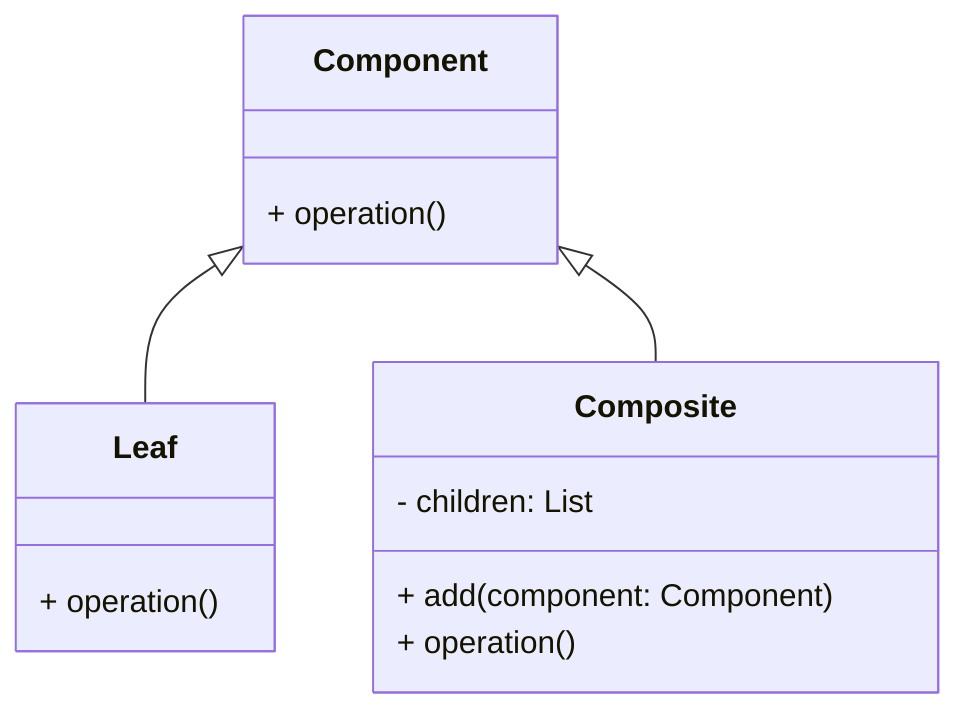
```java
interface Component {
   void operation();
}

class Leaf implements Component {
   public void operation() { System.out.println("Leaf operation"); }
}

class Composite implements Component {
   private List<Component> children = new ArrayList<>();

   public void add(Component component) { children.add(component); }

   public void operation() { 
       for (Component child : children) child.operation(); 
   }
}
```

- **Proxy Pattern**
  - Provides a surrogate or placeholder for another object to control access to it.
  - Useful for lazy initialization, access control, logging, etc.
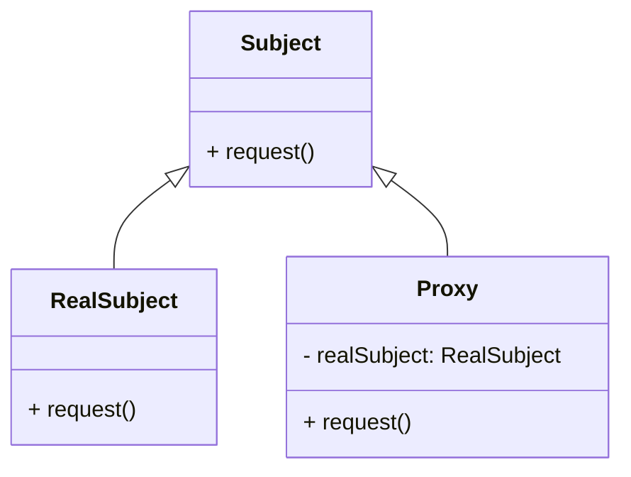
```java
interface Subject {
   void request();
}

class RealSubject implements Subject {
   public void request() { System.out.println("Real subject request"); }
}

class Proxy implements Subject {
   private RealSubject realSubject;

   public void request() { 
       if (realSubject == null) realSubject = new RealSubject(); 
       realSubject.request(); 
   }
}
```
### **3. Behavioral Patterns**
Behavioral patterns focus on communication between objects, what goes on between objects and how they operate together.

- **Observer Pattern**
  - Defines a one-to-many dependency between objects so that when one object changes state, all its dependents are notified and updated automatically.
  - Commonly used in event handling systems.
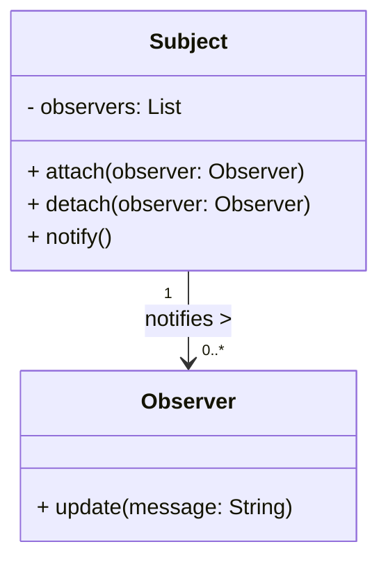
```java
interface Observer {
   void update(String message);
}

class ConcreteObserver implements Observer {
   public void update(String message) { System.out.println("Received: " + message); }
}

class Subject {
   private List<Observer> observers = new ArrayList<>();

   public void attach(Observer observer) { observers.add(observer); }

   public void notifyObservers(String message) { 
       for (Observer observer : observers) observer.update(message); 
   }
}
```

- **Strategy Pattern**
  - Defines a family of algorithms, encapsulates each one, and makes them interchangeable. The strategy lets the algorithm vary independently from clients that use it.
  - Useful for situations where multiple algorithms can be applied based on varying conditions.
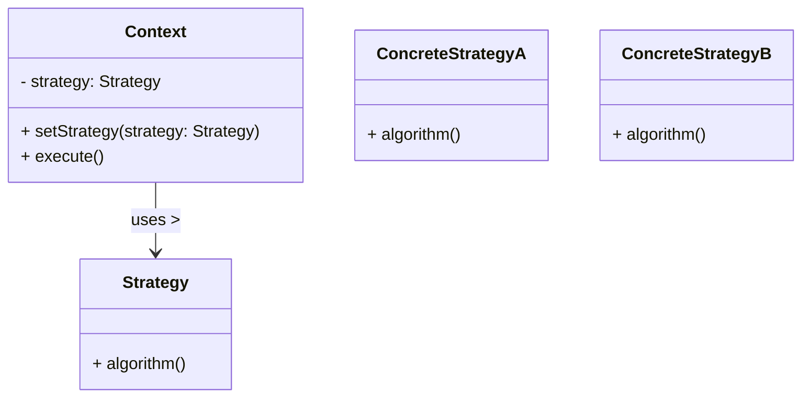
```java
interface Strategy {
   int execute(int a, int b);
}

class Addition implements Strategy { 
   public int execute(int a, int b) { return a + b; } 
}

class Context { 
   private Strategy strategy; 

   Context(Strategy strategy) { this.strategy = strategy; } 

   int executeStrategy(int a, int b) { return strategy.execute(a, b); } 
}
```

- **Command Pattern**
  - Encapsulates a request as an object, thereby allowing users to parameterize clients with queues, requests, and operations.
  - Facilitates undoable operations by storing commands as objects.
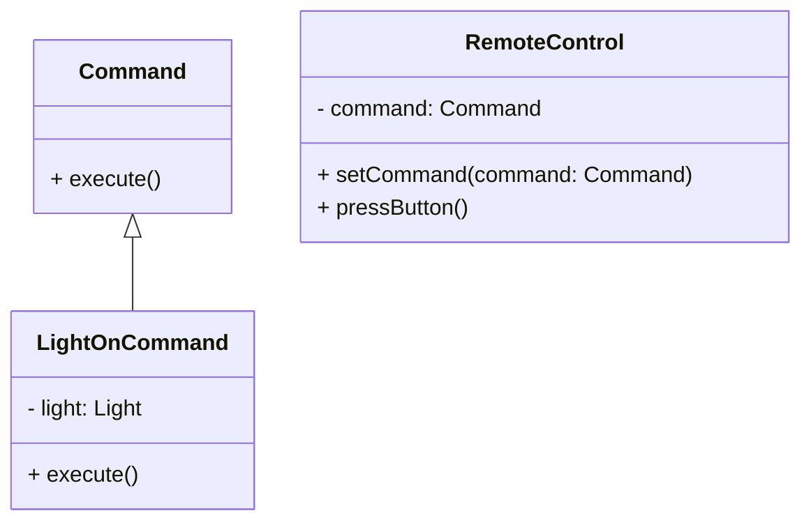
```java
interface Command { 
   void execute(); 
}

class LightOnCommand implements Command { 
   private Light light; 

   LightOnCommand(Light light) { this.light = light; } 

   public void execute() { light.turnOn(); } 
}

// Invoker class
class RemoteControl { 
   private Command command; 

   public void setCommand(Command command) { this.command = command; } 

   public void pressButton() { command.execute(); } 
}
```

- **State Pattern**
  - Allows an object to alter its behavior when its internal state changes. The object will appear to change its class.
  - Useful for implementing finite state machines.
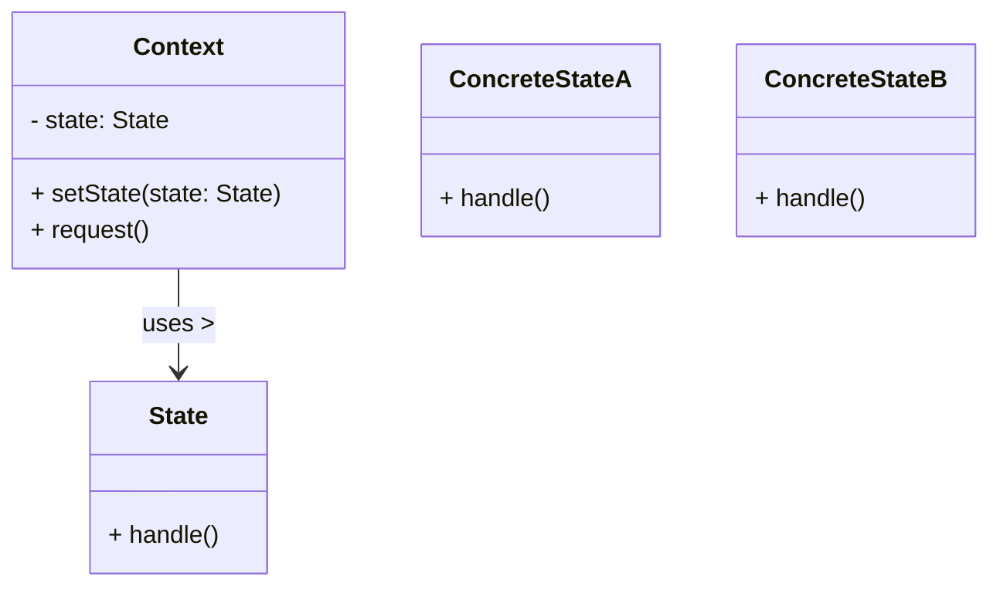
```java
interface State { 
   void handle(); 
}

class Context { 
   private State state; 

   public void setState(State state) { this.state = state; } 

   public void request() { state.handle(); } 
}

// Example states
class ConcreteStateA implements State { 
   public void handle() { System.out.println("Handling State A"); } 
}

class ConcreteStateB implements State { 
   public void handle() { System.out.println("Handling State B"); } 
}
```

- **Template Method Pattern**
  - Defines the skeleton of an algorithm in a method, deferring some steps to subclasses. Template Method lets subclasses redefine certain steps without changing the algorithm's structure.
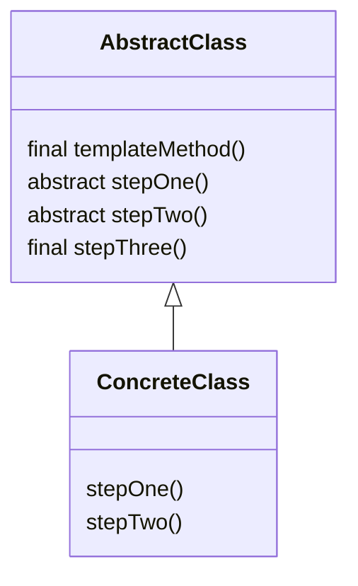
```java
abstract class AbstractClass { 
   // Template method
   final void templateMethod() { 
       stepOne(); 
       stepTwo(); 
       stepThree(); 
   }

   abstract void stepOne(); // Steps to be implemented by subclasses

   abstract void stepTwo();

   final void stepThree() { System.out.println("Common Step"); } // Fixed implementation
}

// Example subclass
class ConcreteClass extends AbstractClass { 
   @Override 
   void stepOne() { System.out.println("Step One Implementation"); }

   @Override 
   void stepTwo() { System.out.println("Step Two Implementation"); } 
}
```

### **Conclusion**
Understanding these design patterns is crucial for Java developers as they provide proven solutions that can enhance code maintainability and scalability. Familiarity with these patterns will also help you articulate your design decisions more effectively during interviews.

Citations:
[1] https://www.whizlabs.com/blog/mastering-java-interview-questions/
[2] https://www.indeed.com/career-advice/interviewing/java-basic-interview-questions
[3] https://www.linkedin.com/pulse/ultimate-guide-cracking-your-java-interview-kranthi-shaik
[4] https://workplace.stackexchange.com/questions/168944/cant-remember-much-from-previous-working-experiences
[5] https://www.linkedin.com/pulse/java-interview-tips-guide-aspiring-developers-ali-mirzajanzadeh
[6] https://in.linkedin.com/in/jeyasinghalex
[7] https://www.udemy.com/course/java-interview-questions-and-answers/
[8] https://www.javatpoint.com/how-to-prepare-for-java-interview