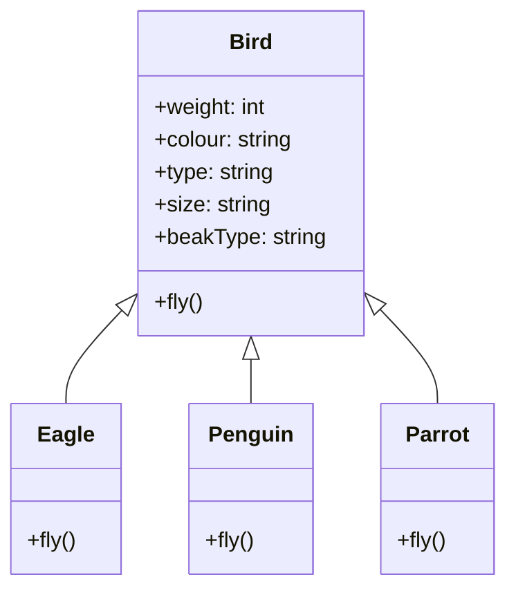

## Liskov Substitution Principle
- states that objects in a program should be replaceable with instances of their subtypes without altering the correctness of that program
- Let us take a look at our final version of the `Bird` class from [[05 - SOLID - Single Responsibility, Open-Closed Principle]]
- We started with a `Bird` class which had SRP and OCP violations. We now have a `Bird` abstract class which can be extended by the `Eagle`, `Penguin` and `Parrot` subclasses.



- All the subclasses of `Bird` have to implement this method. A penguin cannot fly, yet we have added a `fly()` method to the `Penguin` class.
- In the above methods, we are trying to force a contract on a class which does not follow it.
```java
List<Bird> birds = List.of(new Eagle(), new Penguin(), new Parrot());
for (Bird bird : birds) {
    bird.fly();
}
```
- This is a violation of the Liskov Substitution Principle.
- if we have a `Bird` object, we should be able to replace it with an instance of its subclasses without altering the correctness of the program. 
- In our case, we cannot replace a `Bird` object with a `Penguin` object because the `Penguin` object requires special handling.