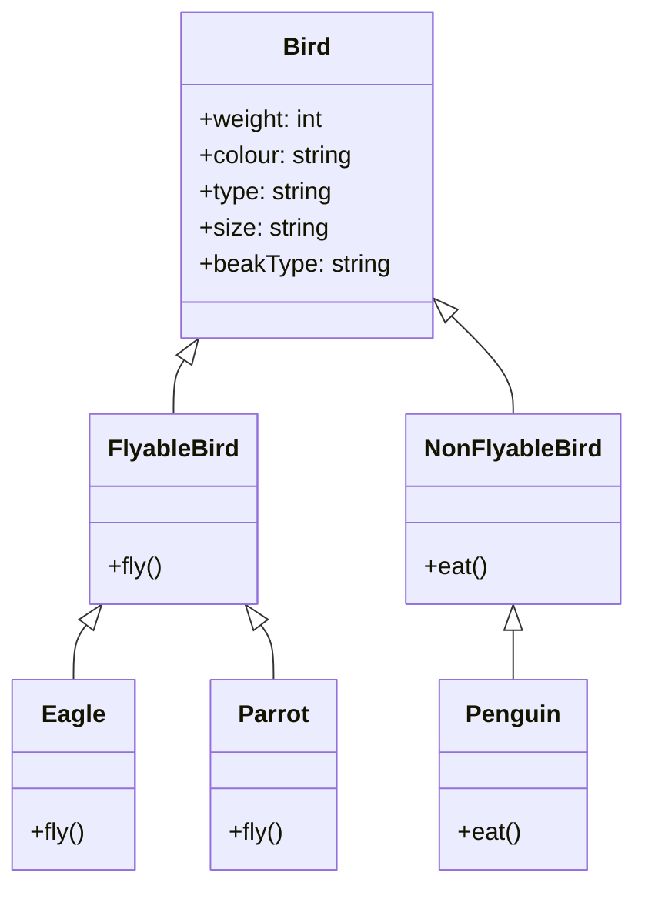
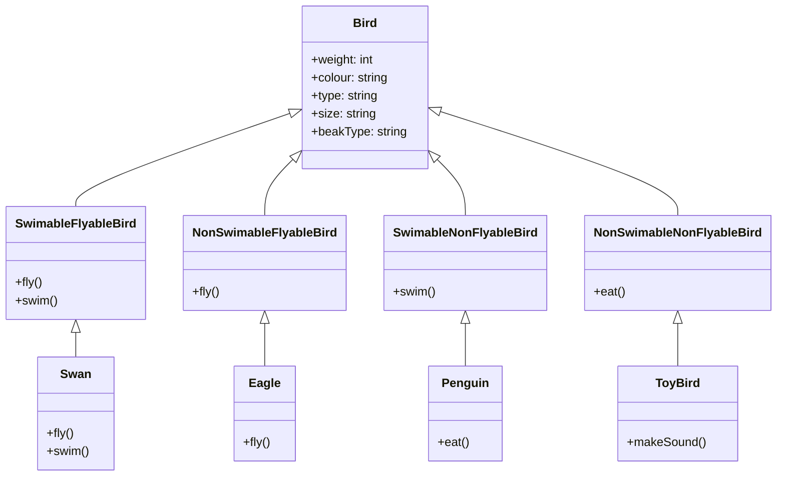
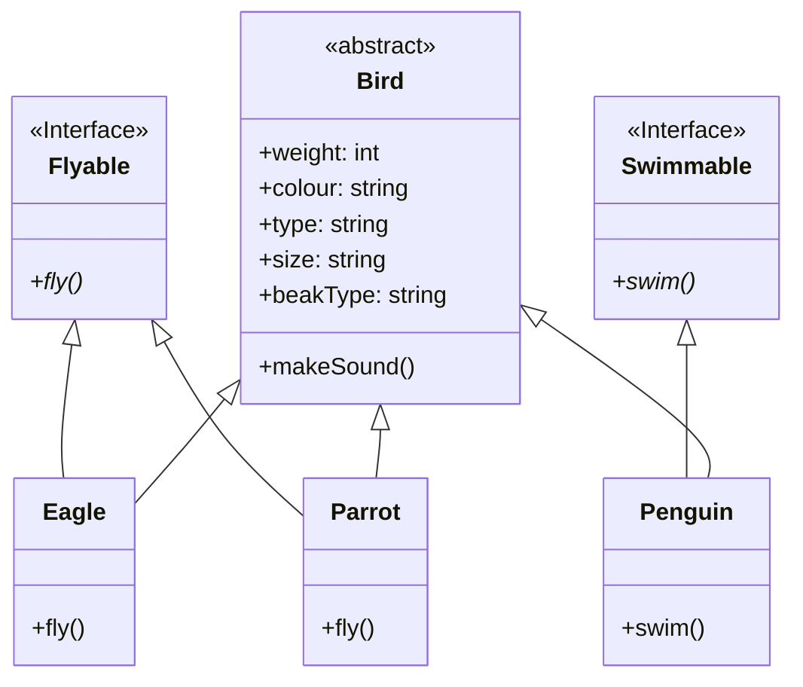

## Liskov Substitution Principle
- <mark class="hltr-g">states that objects in a program should be replaceable with instances of their subtypes without altering the correctness of that program</mark>
- Let us take a look at our final version of the `Bird` class from [[05 - SOLID - Single Responsibility, Open-Closed Principle]]
- We started with a `Bird` class which had SRP and OCP violations. We now have a `Bird` abstract class which can be extended by the `Eagle`, `Penguin` and `Parrot` subclasses.


- All the subclasses of `Bird` have to implement this method. A penguin cannot fly, yet we have added a `fly()` method to the `Penguin` class.
- In the above methods, we are trying to force a contract on a class which does not follow it.
```java
List<Bird> birds = List.of(new Eagle(), new Penguin(), new Parrot());
for (Bird bird : birds) {
    bird.fly();
}
```
- This is a violation of the Liskov Substitution Principle.
- if we have a `Bird` object, we should be able to replace it with an instance of its subclasses without altering the correctness of the program. 
- In our case, we cannot replace a `Bird` object with a `Penguin` object because the `Penguin` object requires special handling.
### Fixing Liskov Substitution violation
#### ### Creating new abstract classes
- A way to solve the issue with the `Penguin` class is to create a new set of abstract classes, `FlyableBird` and `NonFlyableBird`.



- This is an example of multi-level inheritance. 
- The issue with the above approach is that we are tying behaviour to the class hierarchy. If we want to add a new type of behaviour, we will have to add a new abstract class.
- For instance if we can have birds that can swim and birds that cannot swim, we will have to create a new abstract class `SwimableBird` and `NonSwimableBird` and add them to the class hierarchy. 
- But now how do you extends from two abstract classes? You can't. Then we would have to create classes with composite behaviours such as `SwimableFlyableBird`
- and `SwimableNonFlyableBird`.

- This is why we should not tie behaviour to the class hierarchy.

#### Creating new interfaces
- We can create an `Flyable` interface and an `Swimmable` interface. 
- The `Penguin` class will implement the `Swimmable` interface and the `Eagle` and `Parrot` classes will implement the `Flyable` interface.


- To identify violations, we can check if we can replace a class with its subclasses having to handle special cases and expect the same behaviour.
- Prefer using interfaces over abstract classes to implement behaviour since abstract classes tend to tie behaviour to the class hierarchy.
---
## Interface Segregation Principle
- states that many <mark class="hltr-g">client-specific interfaces are better than one general-purpose interface.</mark> 
- Clients should not be forced to implement a function they do no need. 
- Declaring methods in an interface that the client doesn’t need pollutes the interface and leads to a “bulky” or “fat” interface
- A fat interface is an interface that has too many methods. 
- If we have a fat interface, we will have to implement all the methods in the interface even if we don’t use them.
- Let us take the example of our `Bird` class. To not tie the behaviour to the class hierarchy, we created an interface `Flyable` and implemented it in the `Eagle` and `Parrot` classes.
```java
public interface Flyable {
    void fly();
    void makeSound();
}
```
- Along with the `fly()` method, we also have the `makeSound()` method in the `Flyable` interface. This is because the `Eagle` and `Parrot` classes both make sounds when they fly. 
- But what if we have a class that implements the `Flyable` interface? The class does not make a sound when it flies. 
- This is a violation of the interface segregation principle. We should not have the `makeSound()` method in the `Flyable` interface.
---

## Dependency Inversion Principle
- refers to the <mark class="hltr-g">decoupling of software modules</mark>. This way, instead of high-level modules depending on low-level modules, both will depend on abstractions.
- <mark class="hltr-o">High-level modules, which provide complex logic, should be easily reusable and unaffected by changes in low-level modules, which provide utility features</mark>. 
- To achieve that, you need to introduce an abstraction that decouples the high-level and low-level modules from each other.
- Our `Bird` class looks pretty neat now. We have separated the behaviour into different lean interfaces which are implemented by the classes that need them. When we add new sub-classes we identify an issue. For birds that have the same behaviour, we have to implement the same behaviour multiple times.
```java
public class Eagle implements Flyable {
    @Override
    public void fly() {
        System.out.println("Eagle is gliding");
    }
}

public class Sparrow implements Flyable {
    @Override
    public void fly() {
        System.out.println("Sparrow is gliding");
    }
}
```
- The above can be solved by adding a default method to the `Flyable` interface. This way, we can avoid code duplication. But which method should be the default implementation? What if in future we add more birds that have the same behaviour? We will have to change the default implementation or either duplicate the code.
- Instead of default implementations, let us abstract the common behaviours to a separate helper classes. We will create a `GlidingBehaviour` class and a `FlappingBehaviour` class. The `Eagle` and `Sparrow` classes will implement the `Flyable` interface and use the `GlidingBehaviour` class. The `Parrot` class will implement the `Flyable` interface and use the `FlappingBehaviour` class.
```java
public class Eagle implements Flyable {
    private GlidingBehaviour glidingBehaviour;

    public Eagle() {
        this.glidingBehaviour = new GlidingBehaviour();
    }

    @Override
    public void fly() {
        glidingBehaviour.fly();
    }
}
```
- Now we have a problem. The `Eagle` class is tightly coupled to the `GlidingBehaviour` class. If we want to change the behaviour of the `Eagle` class, we will have to open the Eagle class to change the behaviour. This is a violation of the dependency inversion principle. We should not depend on concrete classes. We should depend on abstractions.
- Naturally, we rely on interfaces as the abstraction. We create a new interface `FlyingBehaviour` and implement it in the `GlidingBehaviour` and `FlappingBehaviour` classes. The `Eagle` class will now depend on the `FlyingBehaviour` interface.
```java
    interface FlyingBehaviour{
        void fly()
    }
    class GlidingBehaviour implements FlyingBehaviour{
        @Override
        public void fly() {
            System.out.println("Eagle is gliding");
        }
    }
    ...

    class Eagle implements Flyable {
        private FlyingBehaviour flyingBehaviour;

        public Eagle() {
            this.flyingBehaviour = new GlidingBehaviour();
        }

        @Override
        public void fly() {
            flyingBehaviour.fly();
        }
    }
```