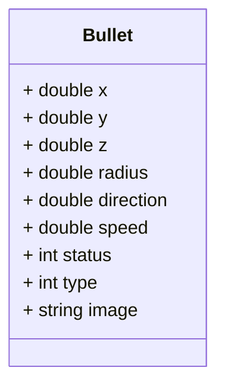
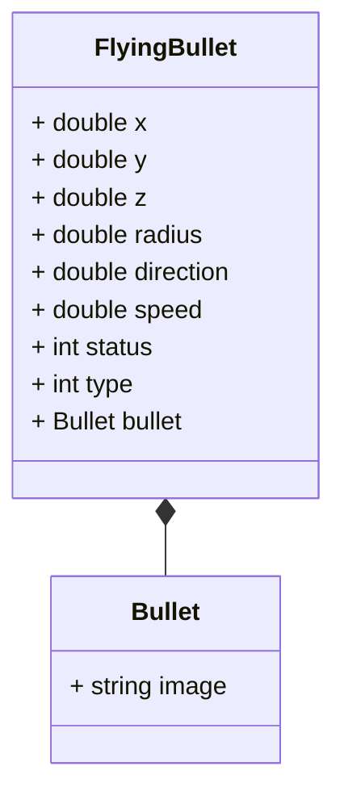

**Structural Patterns**
- design patterns that ease the design by identifying a simple way to realize relationships between entities.
- concerned with how classes and objects are composed to form larger structures.

**Adapter**
- allows the interface of an existing class to be used from another interface. 
- It is often used to make existing classes work with others without modifying their source code.

**Flyweight**
- lets you fit more objects into the available amount of RAM by sharing common parts of state between multiple objects instead of keeping all of the data in each object.

---
## Adapter
- is a structural pattern that allows objects with incompatible interfaces to collaborate.
- Adapter  is a special object that converts the interface of one object so that another object can understand it.
- An adapter wraps one of the objects to hide the complexity of conversion happening behind the scenes. The wrapped object isnʼt even aware of the adapter.

### Problem
- Let us take the example of payment processing.  We first use the Stripe payment gateway.

```java
public class StripeApi {
	public void createPayment() {
		// Create payment
	}
 
	public PaymentStatus checkStatus(String paymentId) {
		// Check payment status
	}
}

...

public void processPayment() {
	StripeApi stripeApi = new StripeApi();
	Payment object = stripeApi.createPayment();
	PaymentStatus status = stripeApi.checkStatus(object.getId());
}
```

- Now we want to integrate with another payment gateway. We use the PayPal payment gateway. 

```java
public class PayPalApi {
	public void makePayment() {
		// Create payment
	}
 
	public PaymentStatus getStatus(String paymentId) {
		// Check payment status
	}
}
```

- As you can see, the Stripe API and the PayPal API have different method names. 
- The Stripe API uses `createPayment` and `checkStatus` while the PayPal API uses `makePayment` and `getStatus`.

### Implementation
- **Incompatible classes** - You should have two classes that have incompatible interfaces. For example, the Stripe API and the PayPal API.

```java
public class StripeApi {
	public void createPayment() {
		// Create payment
	}
 
	public PaymentStatus checkStatus(String paymentId) {
		// Check payment status
	}
}

public class PayPalApi {
	public void makePayment() {
		// Create payment
	}
 
	public PaymentStatus getStatus(String paymentId) {
		// Check payment status
	}
}
```

- **Adapter interface** - Create an interface for the adapter that will be used to convert the incompatible interfaces.

```java 
public interface PaymentProvider {
	void makePayment();
	PaymentStatus getStatus(String paymentId);
}
```

- **Concrete adapter classes** - Create a class that implements the target interface. This is the class that the client code expects to work with. The adapter will convert the interface of the existing class to this interface.

```java 
public class StripePaymentProvider implements PaymentProvider {
	@Override
	public void makePayment() {
		...
	}
	
	@Override
	public PaymentStatus getStatus(String paymentId) {
		...
	}
}

public class PayPalPaymentProvider implements PaymentProvider {
	@Override
	public void makePayment() {
		...
	}
	
	@Override
	public PaymentStatus getStatus(String paymentId) {
		...
	}
}
```

- **Transform request and delegate to original class** - In the adapter class, transform the request to the format that the original class expects. Then, call the original class to perform the operation.

```java 
public class StripePaymentProvider implements PaymentProvider {
	private StripeApi stripeApi = new StripeApi();
 
	@Override
	public void makePayment() {
		stripeApi.createPayment();
	}
	
	@Override
	public PaymentStatus getStatus(String paymentId) {
		StripeStatus status = stripeApi.checkStatus(paymentId);
		return convertStatus(status);
	}
}
```

- **Client code** - The client code expects to work with the target interface. The client code doesnʼt know that the adapter is converting the interface of the original class.

```java 
public class PaymentProcessor {
	private PaymentProvider paymentProvider;
 
	public PaymentProcessor(PaymentProvider paymentProvider) {
		this.paymentProvider = paymentProvider;
	}
	
	public void processPayment() {
		paymentProvider.makePayment();
		PaymentStatus status = paymentProvider.getStatus("paymentId");
	}
}
```

### Advantages
- You can use adapters to reuse existing classes with incompatible interfaces.
- You can even modify the request and response of the original classes.
- Single Responsibility Principle. You can separate the interface or data conversion code from the primary business logic of the program.
- Open/Closed Principle. You can introduce new types of adapters into the program without breaking the existing client code, as long as they work with the adapters through the target interface.

---

## Flyweight Pattern 
- is used to reduce the memory footprint of a program by sharing as much data as possible with similar objects.

**Example**
- We assume the role of game developer and are looking to create a role-playing game like PUBG, counter strike etc. We modeled our game in various classes such as Map, User, Gun and Bullet.



- The memory used by a single bullet instance would be:
	- Double - 8 bytes * 6 = 48 bytes
	- Integer - 4 bytes * 2 = 8 bytes
	- Image - 1KB

- For 2000 bullets for 200 players the memory usage would be 800MB.
- The major problem here is for each object, the image field consumes a lot of memory. The image is also the same for all the bullets.
- Other parts of a particle’s state, such as coordinates, movement vector and speed, are unique to each particle. After all, the values of these fields change over time. This data represents the always changing context in which the particle exists, while the color and sprite remain constant for each particle.
- This constant data of an object is usually called the **intrinsic state**. It lives within the object; other objects can only read it, not change it. 
The rest of the object’s state, often altered “from the outside” by other objects, is called the **extrinsic state**.

- The Flyweight pattern suggests that you stop storing the extrinsic state inside the object. Instead, you should pass this state to specific methods which rely on it. 
- Only the intrinsic state stays within the object, letting you reuse it in different contexts.

- So our Bullet class will have to be divided into two classes. 
- One class will contain the intrinsic state and the other class will contain the extrinsic state. The extrinsic state will be passed to the methods that need it.



- Now, every bullet will have a reference to the Bullet object. 
- The Bullet object will contain the image field. 
- The FlyingBullet class will contain the extrinsic state. Each bullet does not need to have its own image field. 
- The image field is shared between all the bullets. This way, the memory usage is reduced.

### Implementation

- **Intrinsic state** - The intrinsic state is stored in the flyweight object. It is independent of the flyweight’s context and remains the same for all flyweight objects.

```java 
public class Bullet {
    private String image;
}
```

- **Extrinsic state** - The extrinsic state is stored or computed by client objects. It depends on the flyweight’s context and changes with it.

```java 
public class FlyingBullet {
    private double x;
    private double y;
    private double z;
    private double radius;
    private double direction;
    private double speed;
    private int status;
    private int type;
    private Bullet bullet;
}
```

- **Flyweight factory** - The flyweight factory is responsible for creating and managing flyweight objects. It ensures that flyweights are shared properly. When a client requests a flyweight, the flyweight factory either returns an existing instance or creates a new one, if it doesn’t exist yet.

```java 
public class BulletFactory {
    private static final Map<String, Bullet> bullets = new HashMap<>();

    public Bullet getBullet(BulletType type) {
        ...
    }

    public void addBullet(BulletType type, Bullet bullet) {
        ...
    }
}
```

- **Client code** - The client code usually creates a bunch of pre-populated flyweights in the initialization stage of the application.
