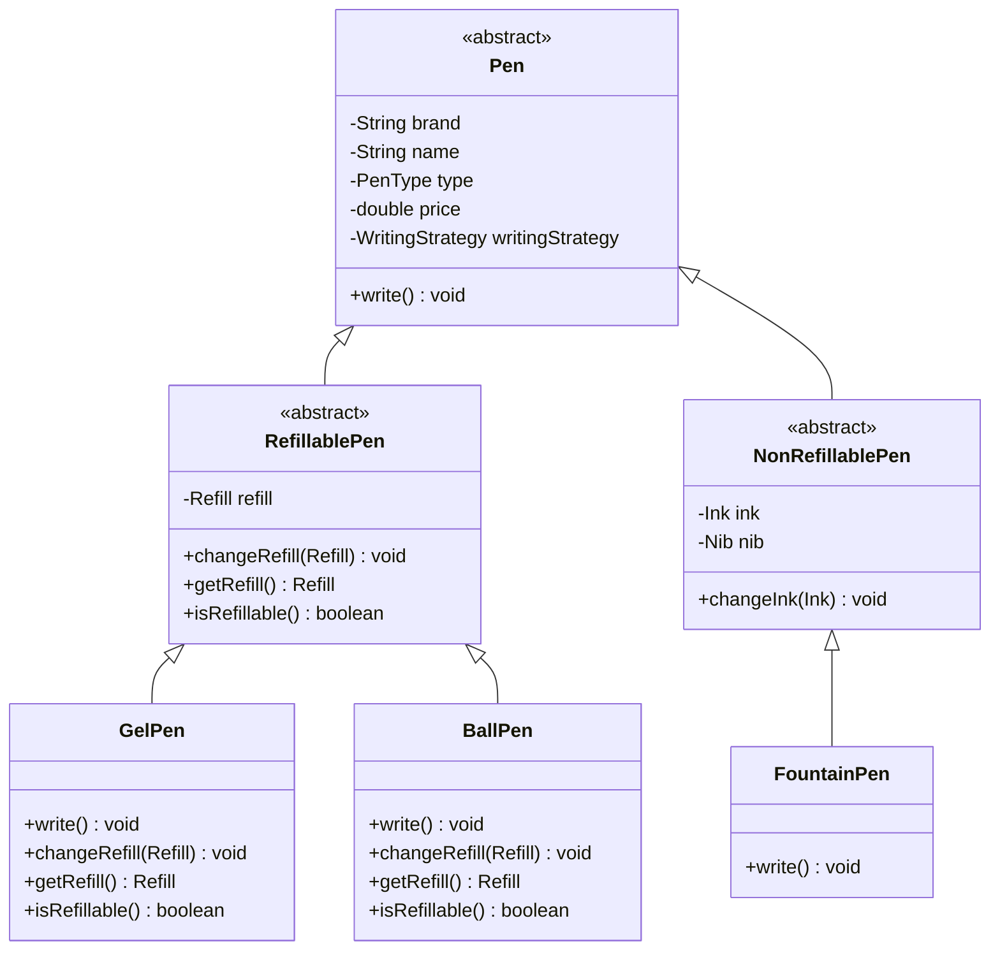
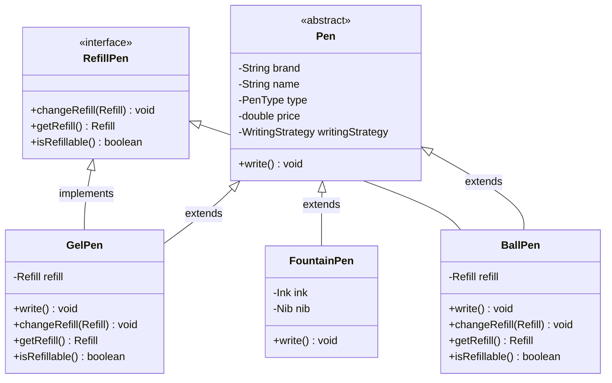

## Requirements

* A pen is anything that can write.
* Pen can be Gel, Ball, Fountain, Marker.
* Ball Pen and Gel Pen have a Ball Pen Refill and a Gel Pen Refill respectively to write.
* A refil has a tip and an ink.
* Ink can be of different colour
* A fountain pen has an Ink.
* Refil has a radius. 
* For fountain pen, its tip has a radius.
* Each pen can write in a different way.
* Some pens write in the same way.
* Every pen has a brand and a name.
* Some pens may allow refilling while others might not.

## Entities and Attributes

* Pen
  * Brand
  * Name
  * Type (Gel, Ball, Fountain, Marker)
  * Price
*  Refill
  * Type (Ball, Gel)
  * Ink
  * Nib
* Ink
  * Colour
  * Brand
  * Type (Gel, Ball, Fountain)
* Nib
  * Radius
  * Type (Fountain, Ball, Gel)  

### Different types of pens
* Gel Pen
  * Type - `Gel`
  * Refill
    * Type - `Gel`
    * Nib - `Gel`
    * Ink
      * Type - `Gel`
    * Refillable - `Yes`

* Ball Pen
  * Type - `Ball`
  * Refill
    * Type - `Ball`
    * Nib - `Ball`
    * Ink
      * Type - `Ball`
    * Refillable - `Yes`

* Throwaway Pen
  * Type - `Throwaway`
  * Refill
    * Type - `Ball`
    * Nib - `Ball`
    * Ink
      * Type - `Ball`
    * Refillable - `No`

* Fountain Pen
  * Type - `Fountain`
  * Ink
    * Type - `Fountain`
  * NiB
    * Type - `Fountain`

## Avoiding LSP using abstract classes

### Java Code
[Pen class with abstract classes](https://github.com/kanmaytacker/design-questions/tree/master/src/main/java/com/scaler/lld/pen/abstractclasses)

### Improvements
  * `Liskov Substitution Principle` is followed since `FountainPen` does not have a refill, and it throws an exception when `changeRefill` is called.
  * No field duplication in child classes.

### Problems
  * Behaviour is tied to the class hierarchy. Adding a new type of pen requires changing the class hierarchy.

## Avoiding LSP violation using interface

### Java Code
[Pen class with interface](https://github.com/kanmaytacker/design-questions/blob/master/src/main/java/com/scaler/lld/pen/withinterface)

### Problems
  * Field duplication in child classes.